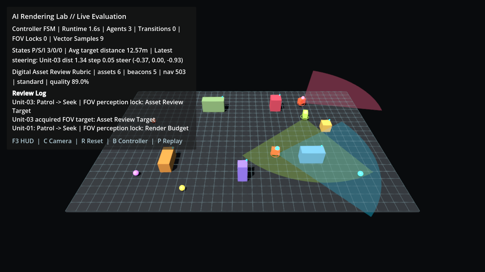
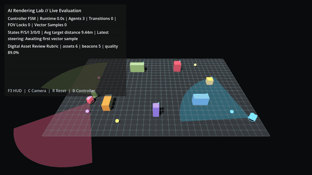

# Godot AI Rendering Lab

A Godot 4 portfolio demo for real-time AI behavior, procedural digital assets, field-of-view perception, steering, live evaluation telemetry, and rendering-review workflows.






## Executive Summary

This project is built to be evaluated quickly by a technical reviewer. It is not a static scene or a toy script. It is a running Godot simulation where autonomous agents patrol a digital twin, perceive targets through visible FOV cones, respond to inspection beacons, avoid procedural assets, and report their reasoning through a live HUD.

Core signals:

- Godot 4 project structure with a real `project.godot` entry point.
- Multi-agent finite state machine: `Patrol`, `Seek`, `Idle`.
- Forward field-of-view perception.
- Blended steering: pursuit, obstacle avoidance, boundary bias, and peer separation.
- Procedural asset construction with material language and clearance semantics.
- Runtime evaluation HUD for state counts, vector samples, asset score, and review events.
- Asset rubric data separated from rendering code.

## Controls

- `F3`: Toggle evaluation HUD.
- `C`: Cycle review camera angles.
- `R`: Reset the simulation.
- `B`: Toggle FSM / behavior-tree controller.
- `P`: Toggle replay ghost playback when a JSONL replay is loaded.

## System Architecture

```text
Main
|-- Rendering setup
|   |-- WorldEnvironment
|   |-- Directional and fill lighting
|   `-- ReviewCamera
|-- DigitalTwinEnvironment
|   |-- Procedural floor and grid
|   |-- Digital asset blocks
|   |-- Navigation bounds
|   |-- Sensor beacons
|   `-- Asset review rubric
|-- SimulationDirector
|   |-- Agent spawning
|   |-- Event aggregation
|   `-- Metrics snapshots
|-- AutonomousAgent[]
|   |-- FSM state
|   |-- FOV perception volume
|   |-- Steering vector calculation
|   `-- Console telemetry
`-- DebugHud
    |-- Runtime metrics
    |-- Agent state counts
    |-- Latest steering sample
    `-- Asset quality summary
```

## Core Mechanics

### Multi-Agent FSM

Each agent owns its state and transition logic:

- `Patrol`: Sample a navigable waypoint and roam the digital twin.
- `Seek`: Lock onto a perceived sensor beacon and respond at a higher movement speed.
- `Idle`: Pause briefly to create believable cadence and route replanning space.

Transitions are emitted to both the console and the HUD.

### FOV Perception

Agents scan for beacons inside a forward-facing cone. The perception model considers distance, field angle, priority, cooldown, and a small stochastic weight. This makes target acquisition visible and reviewable.

### Steering

Movement blends:

- Desired target direction.
- Obstacle repulsion from digital assets.
- Peer separation between agents.
- Boundary bias near the navigable limits.
- Final clamp against world bounds.

The latest steering sample is surfaced in the HUD so a reviewer can correlate visible movement with vector math.

### Digital Asset Review

The environment includes `data/asset_review_rubric.json`, a compact quality framework for asset readability, material language, navigation affordance, telemetry value, and render-budget awareness. The HUD reports the current asset score and counts.

## Requirements

- Godot 4.6 or newer.
- No third-party plugins.

## Run

Open the folder in Godot and press Run.

Command-line:

```powershell
godot --path .
```

If installed through Winget, restart the terminal so the `godot` alias is available, or launch the executable directly from the Winget package folder.

## Files Of Interest

- `scenes/main.tscn`: Main scene.
- `scripts/main.gd`: Rendering setup, camera modes, simulation lifecycle.
- `scripts/simulation_environment.gd`: Procedural assets, navigability, beacons, rubric loading.
- `scripts/autonomous_agent.gd`: FSM, FOV perception, steering, vector telemetry.
- `scripts/simulation_director.gd`: Multi-agent orchestration and metrics aggregation.
- `scripts/debug_hud.gd`: Live evaluation overlay.
- `data/asset_review_rubric.json`: Asset-quality framework.
- `docs/REPLAY_FORMAT.md`: JSONL capture/playback contract.
- `docs/TECHNICAL_REVIEW.md`: Deeper reviewer guide.

## Validation

Headless project boot:

```powershell
godot --headless --path . --quit
```

Expected signal: the console should report three agents transitioning from `Idle` to `Patrol`, followed by the director startup message.

## Media Capture

The committed screenshot and GIF are generated from the running Godot scene through Movie Maker frames and FFmpeg palette conversion:

```bash
make capture-media GODOT=godot FFMPEG=ffmpeg
```

The target records 240 frames at 30 FPS, copies frame 60 to `media/hero.png`, and converts the full 8-second Patrol/Seek run to `media/patrol-seek.gif`.

## Roadmap

- Screenshot and replay capture for review packets.
- Navmesh path planning for denser environments.
- Behavior-tree variant alongside the FSM.
- GLB asset import examples with metadata-driven collision descriptors.
- External planner hooks for assigning inspection objectives.
- Automated visual and telemetry scoring for digital asset refinement.
